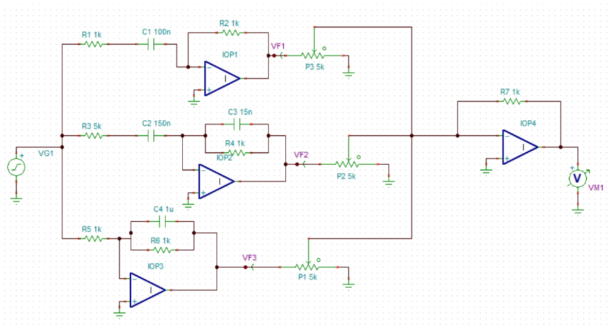
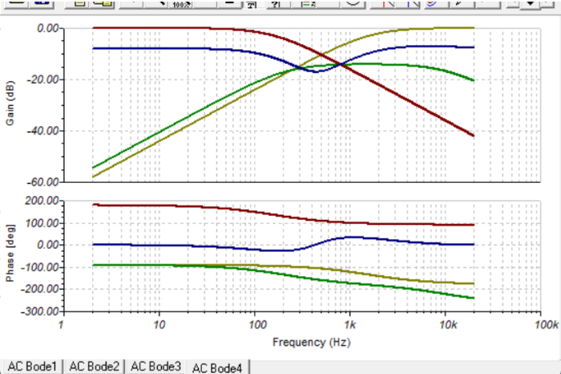
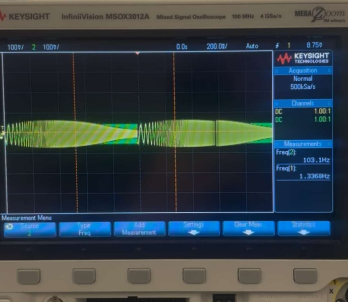

# 3-Band Audio Equalizer

This project focuses on the design and analysis of a 3-band audio equalizer
using op-amp-based low-, mid-, and high-frequency filters.

## Overview
- Designed active low-pass, band-pass, and high-pass filters
- Combined filter outputs using an op-amp summing stage
- Analyzed frequency response and phase behavior
- Simulated circuits using TINA-TI
- Evaluated breadboard vs PCB implementation trade-offs
- Verified behavior using oscilloscope measurements

## Circuit Schematic

## Frequency Response (Bode Plot)

## Experimental Results
Oscilloscope measurements captured from the implemented circuit:

## Tools & Equipment
- TINA-TI
- Operational amplifiers
- Function generator
- Keysight oscilloscope
